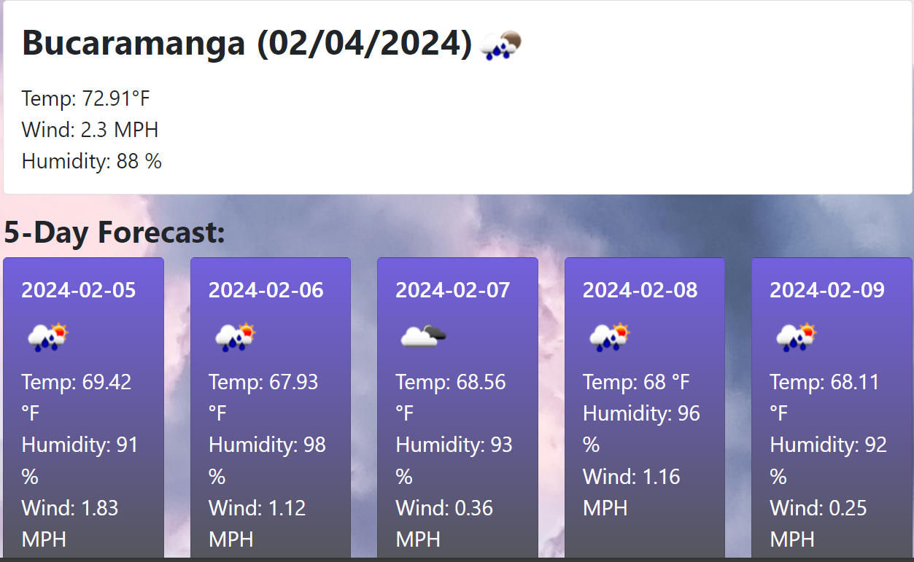
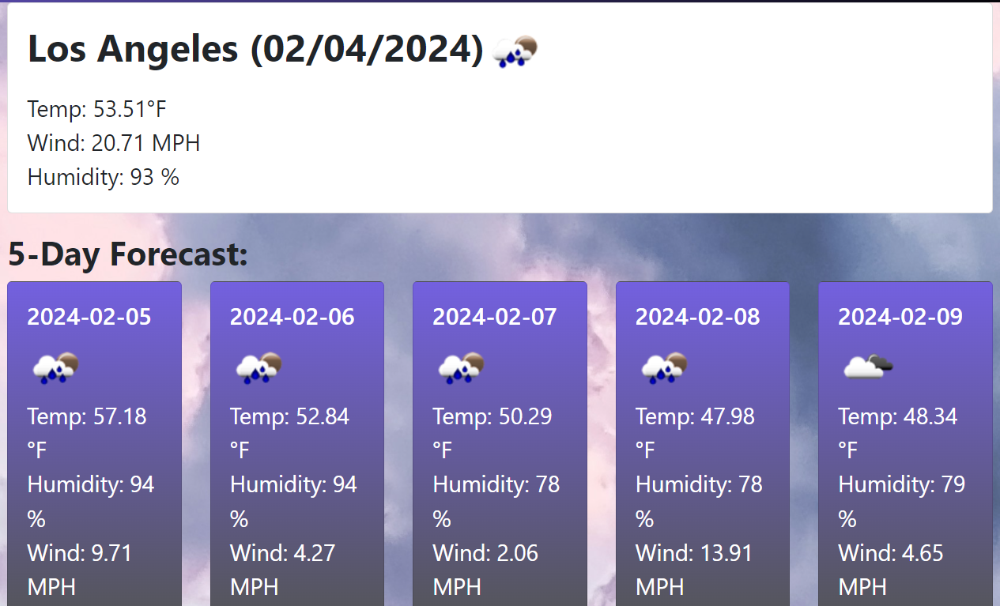
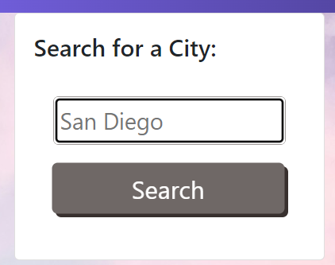
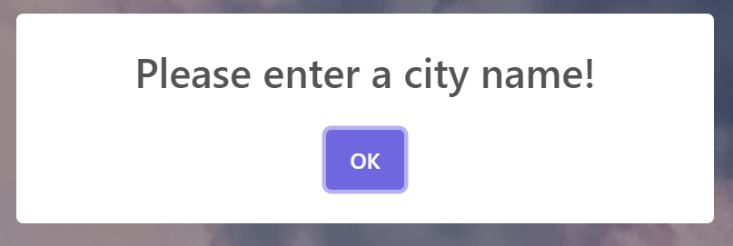
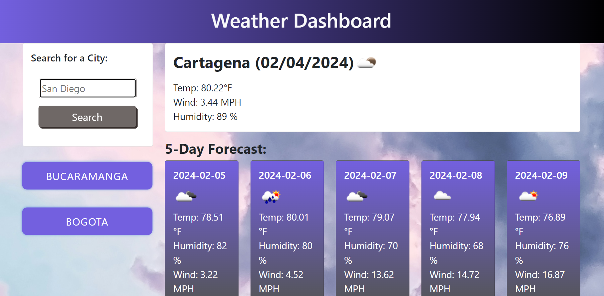

# ⛅weather-dashboard
This is the Challenge -06 related to Server-Side APIs

## Description
This project is a practical application that allows users to check the current weather and forecast for their preferred cities. It provides real-time weather data and a 5-day forecast, giving users the ability to plan their activities accordingly. The app also includes a favorites feature, allowing users to save their frequently visited cities for quick access. With a clean design and responsive layout, this app offers a user-friendly experience across different devices.

## Features

1. Dynamic Date Display.
2. Search History.
3. Responsive Design.
4. API Integration.

## Table of Contents

- [Credits](#credits)
- [License](#license)
- [Website-Appearance](#website)

## Credits

This project uses the ‘Weather data provided by OpenWeather’ (https://openweathermap.org/) to get data.

This project uses the following third-party libraries:
- [SweetAlert](https://sweetalert.js.org) for creating beautiful, responsive dialogs.
- [jQuery](https://jquery.com) for simplifying HTML document traversal, event handling, and animation.
- [Bootstrap](https://getbootstrap.com) for designing responsive and mobile-first websites.
- [Day.js](https://day.js.org) for parsing, validating, manipulating, and displaying dates and times in JavaScript.

Additionally, some material and concepts used in this project were learned from the [University of Denver Bootcamp](https://bootcamp.du.edu/coding/).

## License

Please refer to the LICENSE in the repo.

## Website

Link to the live application: https://nathaliareyes.github.io/weather-dashboard/

The following image shows the web application's appearance and functionality:

## Badges

## Thanks for stopping here!.

